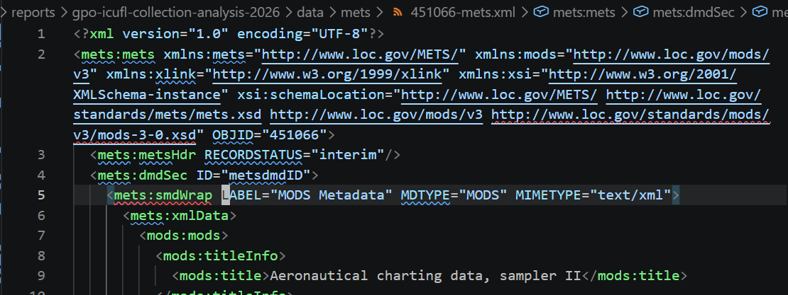
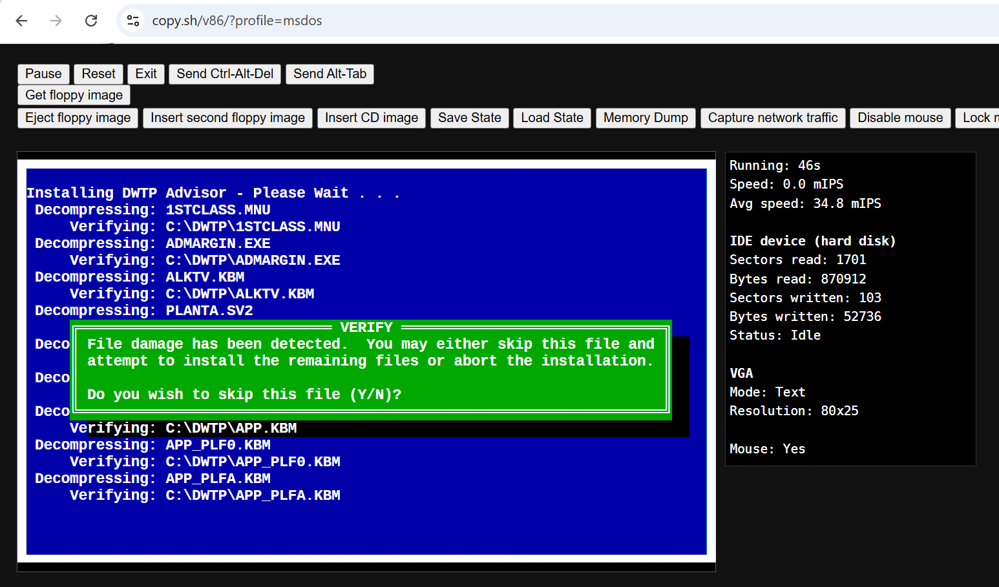

# Reviewing the Indiana University CD-ROM & Floppy Library for the U.S. Government Publication Office

::: {.callout-note}

<a href="https://www.dpconline.org/"></a>
This work was carried out during April/May/June 2026 as [member support](https://www.dpconline.org/digipres/discover-good-practice/dedicated-support-for-members) for the [U.S. Government Publishing Office](https://www.gpo.gov/). If you have any questions, please do [get in touch](mailto:info@dpconline.org).

:::

## Introduction

The Indiana University CD-ROM & Floppy Library (IUCFL) collection is held by the U.S. Government Publication Office (GPO). It represents an archival copy of content that is currently accessible through [this Virtual CD-ROM/Floppy Disk Library web site](https://webapp1.dlib.indiana.edu/virtual_disk_library/). That custom-built web interface cannot be supported long term, so a copy of the underlying data has been submitted to the GPO for long-term preservation in the form of ~1,000 disk images (totalling 1.7TB).

The goal of this review is to survey these files, determine if the data appears to be complete and valid, and outline how future access might be assured. The results of this review are to be made publicly available in order to provide practical information for reuse by the GPO and others.

### Questions

1. Does this appear to be a complete record of the data presented via the web site?
2. Is this collection of disk images self-consistent? Does it appear to be valid?
3. Is this what these kind of captures 'typically' look like? What have others done with large collections of disk images like this?
4. What files and formats are inside the disk images? Could the files be kept as plain files rather than disk images? Can we scan and classify files and formats as _'easy to access'/'safe to ignore'/'requires investigation'_?
5. What might access look like? Does emulation play a role in this?

## Setting up the collaborative documentation

An initial document was drafted in [Quarto](https://quarto.org/) Markdown, with an eye to future publication. However, this was not well-suited to the initial collaborative phase of the work the [Quarto conversion tools](https://quarto.org/docs/tools/jupyter-lab.html#converting-notebooks) were used to convert this to a [Jupyter Notebook file](https://jupyter-notebook.readthedocs.io/en/stable/notebook.html), which could be hosted on [Google Colab](https://developers.google.com/colab).

This means the collaborative features of Google Colab could be used to coordinate across parties, check the results are understandable be all parties, and make sure everyone is happy with the text. The Quarto conversion and publication tooling could then be used to produce this long-term stable version of the report, independent of large scale cloud infrastructure.

Note that no AI tools were used to write this report, or develop the scripts used here.  Some AI tools were used while searching the internet for related tools and resources.

## Setting up remote access

Most institutions have a range of policies and procedures that must be followed when enabling access to content by third parties. With this in mind, setting up access was raised early, long before the project officially started. This ensured there was plenty of time to clarify the process, create and securely transfer access credentials and negotiate the networks and protocols involved.

Fortunately, as the data is not sensitive, access was relatively straightforward and the GPO were able to make a copy of the collection accessible over SFTP in the US, or worldwide by registering a fixed IP address with their I.T. team. 

Next, to carry out the assessment, we needed to set up a temporary access system. Ideally one isolated from any production systems (DPC or GPO) and is easy to clean up afterwards.

### Setting up a GitHub Codespace

We decided to use [GitHub Codespaces](https://github.com/features/codespaces) to run a free, temporary Linux box in the U.S., avoiding the need to pay for a server or set up a fixed IP address elsewhere. Specifically, we used the [DigiPres Sandbox](https://github.com/digipres/sandbox#readme) (created by the [Registries of Good Practice project](https://www.dpconline.org/digipres/collaborative-projects/registries-of-good-practice)), which comes pre-loaded with some specific tools for digital preservation work.

At the time of writing, the local disk volume of a GitHub Codespace is 32GB by default. Nowhere near enough to store all the collection, but enough to cache file system metadata, smaller metadata files, and hold parts of larger files while they are being accessed.

To complete the workspace setup, two browser windows were used so the Google Colab document and the DigiPres Sandbox environment could run side-by-side. Metadata and data files could be downloaded from the Sandbox and uploaded to Google Drive for analysis in Google Colab, and later downloaded for analysis in this document.

### Setting up an RClone connection

We used [RClone](https://rclone.org/) to access the files over SFTP, as this tool is able to access a remote service and only download the data when needed. It also has good credential management support. While the data itself is not sensitive, it's still important to be careful with the SFTP access credentials, as these do permit access to a GPO server. 

Firstly, when creating the credentials, the GPO ensured that these were unique credentials dedicated to this task, and as such, that the corresponding account only had _read_ access to _the specific files needed_ (see [Principle of least privilege](https://en.wikipedia.org/wiki/Principle_of_least_privilege)).

Secondly, when [configuring RClone](https://rclone.org/commands/rclone_config_create/) to talk to the server (which RClone calls a 'remote'), care was taken to store the password in an [encrypted](https://rclone.org/commands/rclone_config_encryption_set/) form and use a _separate_ dedicated password to protect the configuration. This latter password can be entered when needed, or stored as a temporary environment variable:

```bash
export RCLONE_CONFIG_PASS=XXXXXXXX
```

With the connection set up, it can be tested using:

```bash
rclone -vvvv ls gpo:.
```

This lists the files at the top-level of the `gpo` 'remote' presented by the SFTP server. The `-vvvv` part makes it very verbose, so it emits a lot of logging, which means we can check it's doing what we expect.

### Setting up an RClone mount

To simplify exploration, we up an RClone ['mount'](https://rclone.org/commands/rclone_mount/). This means we have a folder on the Codespace server that acts like it's local but is actually pulling in files from the remote server as needed. We set it up like this:

```bash
mkdir -p ./remote
rclone mount --vfs-cache-mode full gpo: ./remote 2>&1 > rclone-remote-mount.log &
```

This creates a folder called `remote` and runs a background `rclone` process that 'mounts' the `gpo` remote into that folder, [caching as much as possible](https://rclone.org/commands/rclone_mount/#vfs-file-caching), and logging and warnings or issues to a file called `rclone-remote-mount.log`.

At this point, we e.g. can list the files at the top-level of the remote like this:

```bash
cd remote
ls -l
```

It proved helpful to run a recursive list process, like this:

```bash
ls -R
```

As this prompted the RClone service to download and cache all of the remote filesystem metadata.  Occasionally, things would slow down or fail, but after checking the logs, it was clear these were usually temporary problems due to RClone temporarily overloading the remote SFTP server. When that happened, it was usually sufficient to just retry things a few moments later.


## Initial exploration via the RClone mount

Manually exploring the file system this way worked well, and it was easy to determine the overall structure of the dataset. Within a containing folder called `GPO_CDFLOPPY_DATA` we found a long list of folders with numbers for names and one file called `part_2.md5` (a checksum manifest).

The names of the folders correspond to the numbers used on the web site. So, for example, the web entry [Urban soil lead abatement demonstration project : EPA data dictionary with associated data sets](https://webapp1.dlib.indiana.edu/virtual_disk_library/index.cgi/923520) has `923520` in the URL, corresponding to:

```bash
$ ls -l remote/GPO_CDFLOPPY_DATA/923520
total 1454
-rw-r--r-- 1 jovyan jovyan 1474560 Mar  5 16:56 30000102588401.img
-rw-r--r-- 1 jovyan jovyan     312 Mar  5 16:56 30000102588401.img.idx
-rw-r--r-- 1 jovyan jovyan    7275 Mar  5 16:56 923520-marc.xml
-rw-r--r-- 1 jovyan jovyan    6144 Mar  5 16:56 923520-mets.xml
```

Every directory appeared to be the same basic structure, with an `.img` or `.iso` file depending on whether the source was a floppy disk or a CD-ROM/DVD. This is accompanied by a MARC XML file, a METS XML file, and an `.idx` file.

### Counting items
As a first simple check, we see how many folders there are:

```bash
$ ls -1 remote/GPO_CDFLOPPY_DATA/ | wc
   1079    1079    8586
```

However, using the paging function of the website and going to [the last page of results](https://webapp1.dlib.indiana.edu/virtual_disk_library/index.cgi/listall?submit=next&page=17), we see that the site contains 1,843 entries.

Manually sampling and looking for examples, e.g. [Hong Kong : a new era](https://webapp1.dlib.indiana.edu/virtual_disk_library/index.cgi/5086416) which is not in the submitted file set, is marked as `[Restricted to IU]` in the web interface.

```bash
jovyan@codespaces-5550f4:/workspaces/sandbox$ ls -1 remote/GPO_CDFLOPPY_DATA/5086416
ls: cannot access 'remote/GPO_CDFLOPPY_DATA/5086416': No such file or directory
jovyan@codespaces-5550f4:/workspaces/sandbox$ ls -1 remote/GPO_CDFLOPPY_DATA/7356902
ls: cannot access 'remote/GPO_CDFLOPPY_DATA/7356902': No such file or directory
```

So, at least some of `[Restricted to IU]` subset are not present. The precise situation is difficult to verify without a list of all IDs and their access status, but it is reasonable to assume this was taken care of when the export was created. This does, however, mean we can't independently verify the collection is complete at this level. At least without writing a web crawler that scrapes the whole collection and pulls out the access status of each entry.

This was raised with GPO, who were then able to take this information and consider how they might use it to verify that the overall collection completeness is as expected, and clarify the terms under which the deposited content has been made available.

### Running tools

We also experimented with running tools directly on the files, e.g. the [Siegfried](https://www.itforarchivists.com/siegfried) format identification tool. This illustrated the limits of the RClone mount approach.

Even using the `-throttle` option to slow it down, the files could not be downloaded fast enough for the overall system to work as expected. Oddly, the errors thrown were reported as `permission denied` errors, despite apparently stemming from RClone overloading the remote SFTP server. In general, while the files were findable and openable, running tools on large files and large sets of files was not reliable until the RClone system had had a chance to download the contents and cache them locally. The upshot of this was that by waiting a few minutes between retries, commands like this worked fine:

```bash
jovyan@codespaces-5550f4:/workspaces/sandbox$ sf -csv -throttle 5s remote/GPO_CDFLOPPY_DATA/5259763
filename,filesize,modified,errors,namespace,id,format,version,mime,class,basis,warning
remote/GPO_CDFLOPPY_DATA/5259763/30000076099161_1.iso,652937216,2026-03-05T14:46:21Z,,pronom,fmt/1740,Apple Partition Map Disk Image,,,Aggregate,"extension match iso; byte match at 0, 514 (signature 1/3)",
remote/GPO_CDFLOPPY_DATA/5259763/30000076099161_1.iso.idx,747398,2026-03-05T14:45:57Z,,pronom,x-fmt/111,Plain Text File,,text/plain,,text match ASCII,match on text only; extension mismatch
remote/GPO_CDFLOPPY_DATA/5259763/30000076099161_2.iso,504080384,2026-03-05T14:46:24Z,,pronom,fmt/1740,Apple Partition Map Disk Image,,,Aggregate,"extension match iso; byte match at 0, 514 (signature 1/3)",
remote/GPO_CDFLOPPY_DATA/5259763/30000076099161_2.iso.idx,274675,2026-03-05T14:45:58Z,,pronom,x-fmt/111,Plain Text File,,text/plain,,text match ASCII,match on text only; extension mismatch
remote/GPO_CDFLOPPY_DATA/5259763/5259763-marc.xml,7002,2026-03-05T14:45:58Z,,pronom,UNKNOWN,,,,,,"no match; possibilities based on extension are fmt/101, fmt/121, fmt/120, fmt/896, fmt/1011, fmt/1189, fmt/1374, fmt/1376, fmt/1375, fmt/1377, fmt/1378, fmt/1379, fmt/1474, fmt/1475, fmt/1476, fmt/1477, fmt/1677, fmt/1724, fmt/1729, fmt/1771, fmt/1776, fmt/1813, fmt/1946, fmt/1997, fmt/1998, fmt/1999, fmt/2040, fmt/2080, fmt/2081, fmt/2088"
remote/GPO_CDFLOPPY_DATA/5259763/5259763-mets.xml,7929,2026-03-05T14:45:58Z,,pronom,fmt/101,Extensible Markup Language,1.0,application/xml,Text (Mark-up),"extension match xml; byte match at 0, 19",
```

Unfortunately, this meant that running `sf` over the whole collection was probably not practical, at least at this stage.

## Inspecting an item

Picking [World ocean atlas 1998](https://webapp1.dlib.indiana.edu/virtual_disk_library/index.cgi/4300399) as a reasonable complex example, the disk contents appear to match well with the web presentation. e.g. the ["Raw Mets Record" download](https://webapp1.dlib.indiana.edu/virtual_disk_library/index.cgi/4300399/mets) appears to match the one on disk.

All metadata presented by the web interface appears to be in the METS. The MARC is much more difficult for me to understand, but appears to hold a subset of the information in the METS files.

However, while looking at the METS files in VS Code, the editor appeared to indicate some problems with the XML:



This shows two problems:

- _Error while downloading 'http://www.loc.gov/standards/mods/v3/mods-3-0.xsd'. Server returned HTTP response code: 503 for URL: http://www.loc.gov/standards/mods/v3/mods-3-0.xsd with code: 503 Service Unavailable'._
- _Element name 'smdWrap' is invalid. One of the following is expected: mdRef, mdWrap_

The first problem appears to be an issue with the loc.gov server. The `http` URL for the MODS Schema throws an error, but if we switch to `https` it works. The other `http` URLs all work fine. This was fed back to colleagues at the Library of Congress.

The second problem is stranger. The METS schema makes no mention of an `smdWrap` element, and so it seems likely that these `mets:smdWrap` elements should really be `mets:mdWrap` elements, unless this is a practice from an older version of the METS schema. Having checked versions 1.1, 1.12.1 and 2 of the schema, this does not appear to be the case.

The `.idx` files appear to be custom index files, enumerating the contents of the `.iso` and `.img` files. As example, here's the first 20 lines from an example `.idx` file:

```
jovyan@codespaces-5550f4:/workspaces/sandbox/remote/GPO_CDFLOPPY_DATA/4300399$ head -20 30000065731915_1.iso.idx
# PART-I-TYPE: Partition table type 'Raw CDROM Image', 1 partitions found.
# PART-I-FS: Partition 0 is FS::ISO9660.
# FS-I-VOLDESCUSED: Using Volume Descriptor 0
# FS-I-TYPE: Found ISO-9660 compatible filesystem
# FS-I-VOLDESC: Volume Descriptor [0]:
# FS-I-VOLDESC:   Extension: none/0
# FS-I-VOLDESC:   Block size: 2048
# FS-I-VOLDESC:   Encoding: iso8859-1
# FS-I-VOLDESC: Volume Descriptor [1]:
# FS-I-VOLDESC:   Extension: Joliet/3
# FS-I-VOLDESC:   Block size: 2048
# FS-I-VOLDESC:   Encoding: UCS2-BE
# PART-I-FILECOUNT: 430 valid files found.
# FS-I-VOLDESCUSED: Using Volume Descriptor 1
coordin1.gif|5410|922903234|image/gif|409231360,5410;
coordin5.gif|4299|922903234|image/gif|409237504,4299;
masks|0|922904631|DIR|
masks/basin.msk|17534880|922903250|text/plain|157696,17534880;
masks/landsea.msk|531360|922903252|text/plain|17692672,531360;
programs|0|922904631|DIR|
```

It seems highly likely that these index files are used to construct the [Browse](https://webapp1.dlib.indiana.edu/virtual_disk_library/index.cgi/4300399/FID1913) functionality of the web suite.

In terms of file structure, first there is a header documenting some information about the analysis of the original image file. After than there, is a long list of bar (`|`) separated data.

In that second set of data, the full path of every file and directory is included as the first column, and the file size as the second. The third column seems likely to be a UNIX-style timestamp. The forth column holds the content type, likely used to select an appropriate icon in the browse view and as the `Content-Type` header for the download.

The last column, present only for files (not the folders), is likely to be the position and size of the chunk(s) of that file within the `.iso`/`.img` file. This would mean that, rather than having separate files for the disk image content, when the user requests [`coordin1.gif`](https://webapp1.dlib.indiana.edu/virtual_disk_library/index.cgi/4300399/FID1913/coordin1.gif), the web site can open up the `.iso` file, skip to byte `409,231,360`, and read the next `5,410` bytes and returns them with an `image/gif` header so the browser renders the image.

This means the website can provide the individual files to users by 'carving them out' on demand, without knowing anything about the `.img` and `.iso` formats. In this way, the `.idx` file takes the place of the file system metadata in the image file.

So, in summary, we have:

```
<PATH>|<SIZE>|<TIMESTAMP>|<TYPE>|<OFFSET>,<SIZE>;+
```

Where the final `+` indicates that the `<OFFSET>,<SIZE>;` can be repeated, as some files are made up of separate chunks of data that need to be concatenated together.

Overall, the architectural design of the web service itself appears to be well suited to long-term preservation.  The whole system appears to primarily rely on simple scripts that present the 'master' data which is held in plain files. There is no complex stack or database system to unpick in order to get at the underlying data. Just relatively simple text formats that are used to present data on demand.

The only exception to this appears to be the website's search functionality, which presumably depends on some additional index database technology. However, there is no evidence that there is any _unique_ data in that system. A new replacement index could be constructed from what is provided.

## Checking item-level completeness

As a first step, we focus on attempting to verify the layout of the files for each item is as we expect. That i,s for each numeric identifier, `#`, we have:

- A directory called `#`, containing:
  - A file called `#/#-mets.xml`.
  - A file called `#/#-marc.xml`.
  - One or more `.iso` or `.img` files...
    - Where each of those also has an `.idx` file.
- And none of the files are zero bytes long.

Checking any deeper requires opening up the files, but this check is enough to find any major problems and only needs file system metadata.

First, we listing all the files, using RClone's support for JSON output to collect a simple data file we can analyse here:

```bash
$ rclone jslson -R gpo: > gpo.lsjson
```

We can then download and keep a copy of that data (compressed to save space) and start to work with it. First, we load it up and take a look. This uses the Python [Pandas](https://pandas.pydata.org/) library, which is very widely used for data analysis and can load data from a wide range for formats and encodings.

```{python}
import pandas as pd
# Experimenting with explicit HTML output to see how that affects ePub/PDF generation...
from IPython.display import HTML

df = pd.read_json('data/gpo.lsjson.gz')

# Just show the first five entries:
HTML(df.head(5).to_html())
```

This is telling us about the folders as well as the files, and we're not particularly interested in folders, so we can use Pandas to filter out the entries where the `MimeType` is `inode/directory`, like this:

```{python}
df_f = df[df['MimeType'] != 'inode/directory']

df_f.head(5)
```

We can then loop through this data to gather together the files for each item, looking for any oddities along the way.

```{python}
items = {}
unexpected_files = 0
zero_files = 0
for row in df_f.iterrows():
  # row[0] is the index, row[1] has the data
  # Get the Path, drop the prefix:
  path = row[1]['Path'].replace('GPO_CDFLOPPY_DATA/','')
  # Use this when debugging:
  # print(f"Processing '{path}'...")
  # Skip any known 'exceptional' files:
  if path in ['part_2.md5']:
    print(f"Skipping known non-collection file '{path}'")
    continue
  # Crash on any zero-byte files:
  if int(row[1]['Size']) == 0:
    print(f"Zero byte file found at '{path}'!")
    zero_files += 1
  # Check the path is of the expected form, ID/File...
  # There should be one '/' in the path:
  id, file = path.split('/', maxsplit=1)
  if '/' in file:
    # Use this line to list unexpected files
    print(f"Warning while processing path '{path}': unexpected item in bagging area!")
    unexpected_files += 1
  # Get the list of files for this item, if it exists, or set up a new dictionary:
  item = items.get(id, {})
  # Store the expected files, record unexpected files:
  if file == f"{id}-mets.xml":
    item['mets'] = item.get('mets', 0) + 1
  elif file == f"{id}-marc.xml":
    item['marc'] = item.get('marc', 0) + 1
  elif file.endswith('.iso'):
    item['isos'] = item.get('isos', 0) + 1
  elif file.endswith('.iso.idx'):
    item['iso.idxs'] = item.get('iso.idxs', 0) + 1
  elif file.endswith('.img'):
    item['imgs'] = item.get('imgs', 0) + 1
  elif file.endswith('.img.idx'):
    item['img.idxs'] = item.get('img.idxs', 0) + 1
  else:
    item['unexpected'] = item.get('unexpected', 0) + 1
  # Store the results:
  items[id] = item

# Report:
print(f"Found {len(items.keys())} distinct items.")
print(f"Found {unexpected_files} unexpected files.")
print(f"Found {zero_files} zero-byte files.")
```

This indicates that item `614173` appears to have 29 items nested within it.

We can re-format the results of this process to analyse things a but further. Pulling into a table, we can collect the number of files of different types for each item:

```{python}
df_i = pd.DataFrame.from_dict(items, orient='index')

df_i
```

We can then look for problems. e.g. this is a list of all the items where there appears to be the wrong number of MARC and METS files, i.e. one or both are missing:

```{python}
df_i[(df_i["mets"] != 1) | (df_i["marc"] != 1)]
```

i.e. we can see there are three examples where we have `iso` and `.iso.idx` files, but the MARC and METS files are not there.

Similarly, we can see how many items have 'unexpected' items inside them:

```{python}
df_i[df_i["unexpected"] > 0]
```

This shows the same three items noted earlier.

We can also check if there are any cases where the numbers of `.img.idx` and `.img` files and the `.iso.idx` and `.iso` files don't match up:

```{python}
df_i[(df_i["imgs"] > 0) & (df_i["imgs"] != df_i["img.idxs"])]
```

```{python}
df_i[(df_i["isos"] > 0) & (df_i["isos"] != df_i["iso.idxs"])]
```

And no mismatches were found.

### Alternative techniques

Using a custom Python script and the Pandas table and query language in this way does work, but the whole thing very specific to this case and the implementation and the presentation of results is quite complicated. It would be much better to have a way of more explicitly specifying expected directory layouts in an understandable way, a bit like format signatures. Projects like [`pathschema`](https://apollo-roboto.dev/projects/pathschema/) and [`dirschema`](https://materials-data-science-and-informatics.github.io/dirschema/) potentially establish a lot of the groundwork for this, and an interesting follow-on project would be to look at extending this to identify file layout conventions like data packages.

Indeed, a brief experiment with the `pathschema` tool showed that it was possible to create a `gpo-icufl.pathschema` file that [uses globs and regular expressions](https://github.com/ApolloRoboto/python-pathschema#syntax) to define the expected file naming conventions:

```pathschema
+"[0-9]{6,7}"/
	+*-mets.xml
	+*-marc.xml
	+"[0-9]{14}(|_[1-9])\.(img|iso)"
	+"[0-9]{14}(|_[1-9])\.(img|iso)\.idx"
+part_2.md5
```

This schema can be compared against the contents the ICUFL data folder like this:

```bash
python -m pathschema gpo-icufl.pathschema remote/GPO_CDFLOPPY_DATA/
```

Running this produces a report listing all the files found in the data folder, and whether they meet the expected layout or now. For example, here is the section of the output corresponding to one of the problems noted above:

```
FAIL  /workspaces/sandbox/remote/GPO_CDFLOPPY_DATA/2845618
        Missing required file *-mets.xml
        Missing required file *-marc.xml
```

This is not as precise as a custom script, as it does not check that the item identification numbers match up, that each `.idx` file corresponsed to a specific image file, or that the files are more than zero bytes in size.  However, it was pretty easy to set up and run, it's a lot easier to understand what it's doing, and it correctly spotted all the actual problems we found.

As well as describing local conventions, this `pathschema` approach is a promising potential way of definined file naming conventions for multi-part file formats in general.

## Comparing with the manifest

The `part_2.md5` manifest holds some helpful information. Checking this against the findings above, it seems that _all_ the 'unexpected' files are present, but at the top-level rather than inside the `614173` folder. So this seems to have been a result of an accident, likely a drag-and-drop error, at some point in time after the creation of the manifest. This is very easy to do accidentally, but fortunately, fairly simple to revert.

Of the other three cases, `5536432` and `5536436` are both present in the manifest, and there are no metadata files listed there either. So these two appear to be in the same state as the manifest expects, and any loss the predates the creation of the manifest.

The final case, `2845618`, does not appear in the manifest at all. However, the `part_2.md5` manifest only lists around three hundred distinct items, and the final collection has over a thousand, so this implies there may be a larger `part_1.md5` manifest somewhere that contains more information.

## A pause

At this point, we paused the investigation and reported back the findings so far, so that GPO could take the information on board and start to decide what to do next.  After some discussion, it was decided that we should continue the investigation, and start to look at the contents of the disk images.

## Looking inside (without looking inside)

Rather that download all the data and unpack it, we decided to see how far we can get using only the metadata. The METS files and the `.idx` files were all gathered and downloaded, and these could then be used to build an index of all the files in the collection. This would be enough to start to characterise the contents of the disks, as file extensions are a sufficient format indicator for an initial assessment.

### Aside: on carefully gathering the files

To copy a subset of the files, we started by just listing the files we were interested in. e.g.

```bash
find remote/GPO_CDFLOPPY_DATA/ -name *-mets.xml
```

This creates a long list of simple flat paths, like:

```
remote/GPO_CDFLOPPY_DATA/1006666/1006666-mets.xml
remote/GPO_CDFLOPPY_DATA/1006770/1006770-mets.xml
remote/GPO_CDFLOPPY_DATA/1007939/1007939-mets.xml
...
```

Rather than attempt to write a script (or do anything else complicated enough to go wrong), we used search and replace commands in the text editor (first `/[0-9]+-mets.xml/$0 local-mets\/$0/` then `/^/cp -n /`) to turn each line into a script that would copy each METS file into a `local-mets` folder:

```
cp -n remote/GPO_CDFLOPPY_DATA/1006666/1006666-mets.xml local-mets/1006666-mets.xml
cp -n remote/GPO_CDFLOPPY_DATA/1006770/1006770-mets.xml local-mets/1006770-mets.xml
cp -n remote/GPO_CDFLOPPY_DATA/1007939/1007939-mets.xml local-mets/1007939-mets.xml
...
```

 These copy command use the `-n` or `--no-clobber` option to prevent the script from re-trying copy operations that had already succeeded. This meant we could re-run the script to continue the process if there was a problem with the remote copy that caused the script to fail. After the script ran successfully, the files could be zipped up and downloaded.

## Parsing the METS

In order to be able to link the files in the images to the files on the web site, we needed one more bit of information that wasn't in the filesystem paths or metadata. When browsing the contents of the disk images, the website uses a file identifier of the form `FID####` to determine which file to open, and so to reconstruct those paths, we need to know the mapping from `FID####` identifiers to disk image files like `30000116480330.iso`. This mapping is held in the METS files, like this:

```xml
  <mets:fileSec>
    <mets:fileGrp USE="Disk Image">
      <mets:file ID="FID1218" MIMETYPE="application/octet-stream" DMDID="ID30000116480330">
        <mets:FLocat xlink:href="30000116480330.iso" LOCTYPE="URL" xlink:title="30000116480330.iso"/>
      </mets:file>
    </mets:fileGrp>
  </mets:fileSec>
```

As we were having to parse the METS anyway, it made sense to extract a few more useful bits of metadata at the same time. A small Python script was written that went through all the local files and built a CSV file ([`gpo-icufl-items.csv`](./data/gpo-icufl-items.csv)) with the basic metadata in it, like this:

```csv
item_id,title,date,publisher,fids,fnames,access_conditions
4909450,WAVE-saver for office buildings,[2000],EPA,FID77,30000078832957.iso,GOVUS
4285370,Voluntary reporting of greenhouse gases,1996,"Voluntary Reporting of Greenhouse Gas Program, U.S. Dept. of Energy, Energy Information Administration",FID217|FID2078|FID2451|FID2474,30000044896086.iso|30000048805984.iso|32000000478034.iso|30000053565168.iso,GOVUS
...
```

Or using Pandas:

```{python}
import pandas as pd

df_items = pd.read_csv('./data/gpo-icufl-items.csv')

df_items.head(5)
```


For reference, the source code for the METS parser script is included here:

<details>
<summary>Source code for <tt>parse_mets.py</tt></summary>

```{.python .code-overflow-scroll}

```

</details>

### Access conditions

This table can then be used to check aspects of the metadata. For example, what 'access conditions' are present:

```{python}
df_items.groupby(['access_conditions']).size().reset_index(name='counts')

```

As some of these values are not quite as expected, we can take a look at the ones that are not simply marked `GOVUS`:

```{python}
df_items[df_items["access_conditions"] != 'GOVUS']
```

Having been spotted, [2766887](https://webapp1.dlib.indiana.edu/virtual_disk_library/index.cgi/2766887) and [7295326](https://webapp1.dlib.indiana.edu/virtual_disk_library/index.cgi/7295326) can be reviewed by GPO to check if any action needs to be taken.

Note that the access conditions in the METS can be quite complicated, with one condition asserted at the level of the whole record, and other for each individual media item. The script we used only looked at the latter, so record-level conditions (see e.g. [`For official use only.` in item 4243784](https://webapp1.dlib.indiana.edu/virtual_disk_library/index.cgi/4243784/mets)) are not visible here. By running [`grep`](https://en.wikipedia.org/wiki/Grep) on the METS, we can quickly enumerate the ones that are not simply `GOVUS`:

```{.bash .code-overflow-scroll}
grep accessCondition mets/* | grep -v ">GOVUS<"
mets/1376188-mets.xml:          <mods:accessCondition type="restrictionOnAccess">The included file access software is a copyrighted product of the Asymetric Corp., Bellevue, WA, and may not be copied except as part of this application.</mods:accessCondition>
mets/2766887-mets.xml:            <mods:accessCondition type="restrictionOnAccess">UNKNOWN</mods:accessCondition>
mets/3478741-mets.xml:          <mods:accessCondition type="restrictionOnAccess">For official use only.</mods:accessCondition>
mets/3677392-mets.xml:          <mods:accessCondition type="restrictionOnAccess">Some v. are for official use only, i.e. distribution of Oct. 1998 v. 2 is restricted.</mods:accessCondition>
mets/4243784-mets.xml:          <mods:accessCondition type="restrictionOnAccess">For official use only.</mods:accessCondition>
mets/4274834-mets.xml:          <mods:accessCondition type="restrictionOnAccess">Unclassified.</mods:accessCondition>
mets/7295326-mets.xml:            <mods:accessCondition type="restrictionOnAccess">NOACCESS</mods:accessCondition>
```

These can also be passed back to GPO for review.

## Generating an index

A second script was then created, designed to build a index database from the available metadata. It works by:

- Reading in the items CSV file and extracting the `FID####` mappings.
- Read through the `.idx` files (stored in a ZIP file because they are quite bulky).
- Extract the file-level information from the `.idx` files and combine with the item metadata.
- Output the resulting table of information in the [Parquet](https://parquet.apache.org/) format.
  - Note that this involved making sure the [Parquet row groups](https://parquet.apache.org/docs/concepts/) were large and so not too numerous, and using sorted columns where possible.

<details>
<summary>Source code for <tt>generate_index.py</tt></summary>

```{.python .code-overflow-scroll}

```

</details>

This format was used because there are over six million files in this collection, and a plain CSV version of the data was over 1.2GB in size. The Parquet format compresses the contents very well, leading to a file just 175MB in size that can be parsed and queried effectively.

## Using the index

The Pandas library understand the Parquet format, so this can be used to explore the data:

```{python}
import pandas as pd

df = pd.read_parquet('./data/gpo-icufl-files.parquet')

df.head(5)
```

However, the Pandas query language is quite cumbersome. Instead, we can use the [DuckDB](https://duckdb.org/) run SQL queries on those data tables. 

### File extensions

To count up all the differnet file extensions in the collection, we can use:

```{python}
import duckdb

duckdb.sql("""
  SELECT extension, count(*) AS count
  FROM df
  GROUP BY extension
  ORDER BY count DESC;
  """).df()
```

This does count upper and lower case versions as different extensions, but we can adjust the query to look at the difference that makes:

```{python}
duckdb.sql("""
  SELECT LOWER(extension) as extension, count(*) AS count
  FROM df
  GROUP BY LOWER(extension)
  ORDER BY count DESC;
  """).df()
```

Even after this change, there are still over 3,200 unique file extensions across the whole dataset.

The DuckDB SQL language is quite powerful, and it can be used to perform more complicate queries. For example, we can count file extensions, but also group the results by item they came from, giving us a format profile per item:

```{python}
duckdb.sql("""
  SELECT item_id::INTEGER as item_id, extension, count(*) AS count
  FROM df
  GROUP BY item_id, extension
  ORDER BY item_id DESC, count DESC;
  """).df()
```


### Files and dates

We can also use DuckDB to explore the dates associated with files in the collection, by taking the supplied timestamp and interpreting it as such:

```{python}
import altair as alt

data = duckdb.sql("""
  SELECT date_part('year', make_timestamp(timestamp * 1_000_000)) as year, count(*) AS count
  FROM df
  WHERE year > 1985 AND year < 2010
  GROUP BY year
  ORDER BY year ASC, count DESC;
  """).df()

chart = alt.Chart(data).mark_bar( width=alt.RelativeBandSize(0.8) ).encode(
    x = alt.X('year:O', axis=alt.Axis(labelAngle=-45)),
    y = 'count:Q',
    tooltip=['year', 'count']
).properties(width=420)

# We save an PDF verison of the chart so we can embed the result in e.g. the PDF version of this page:
chart.save("files-by-year.pdf")
```

::: {.content-visible when-format="html"}


```{python}
#| echo: false
chart
```

:::

::: {.content-visible unless-format="html"}

:::

This can be used to extend the item-level format profiles to facet by year (within each item):

```{python}
duckdb.sql("""
  SELECT item_id::INTEGER as item_id, extension, date_part('year', make_timestamp(timestamp * 1_000_000)) as year, count(*) AS count
  FROM df
  GROUP BY item_id, year, extension
  ORDER BY item_id DESC, year DESC, count DESC;
  """).df()
```

<!-- Not sure this adds much

Or even to select the most common year for each combination of item and file extension:

```python
duckdb.sql("""
  SELECT item_id::INTEGER as item_id, extension, mode() WITHIN GROUP (ORDER BY date_part('year', make_timestamp(timestamp * 1_000_000))) as year, count(*) AS count
  FROM df
  GROUP BY item_id, extension
  ORDER BY year DESC, item_id DESC, count DESC;
  """).df()
```

-->

This illustrates a common problem with dates from filesystem metadata not always being accurate: legacy files from the future! Nevertheless, this does show that date information can be extracted and so potentially used to help guide format identification, as most of the date data appears to be realistic (as shown above).

## Reusing the index

The item-level CSV file and the file-level Parquet tables are well-suited to the kind of detailed querying and analysis outlined above. However, they are not very usable by most digital preservation practitions. However, they can be used to support other ways of exploring the collection.

### Publishing format collection profiles

As we're particularly interested in file formats, the file extension queries above were used to create a full [collection profile](https://www.digipres.org/workbench/formats/profiles/) and this was added to the [Digital Preservation Workbench](https://www.digipres.org/workbench/).

This project was also an opportunity to make the Workbench a bit easier to use by separating out the functionality it provides.  Rather than having one big page, there are now separate pages for [comparing collections by file extensions](https://www.digipres.org/workbench/formats/profiles/compare) and [comparing a collection against potentially useful format identification tools and resources based on file extensions](https://www.digipres.org/workbench/formats/profiles/tools).

If you visit those pages, you can now select `The Indiana University CD-ROM & Floppy Library (U.S. Government Publication Office)` as one of the options. This can be fed back to the GPO who can use it to start to explore the more unusual formats in the collection.

### An experimental exploration tool

As well as the summary profile, the item-level index offered a way to experiment with creating simple interfaces that make it easier to understand the collection.

The first challenge was making a c. 100MB file available as part of the Digital Preservation Workbench. This is difficult because GitHub does not allow such large files to be stored directly in a Git repository (for various reasonable reasons!). They do [support](https://docs.github.com/en/repositories/working-with-files/managing-large-files/about-git-large-file-storage) an alternative called [Git LFS](https://git-lfs.com/), which takes a little additional setup, but does then allow larger binaries to be stored and integrated into the website.

The other main challenge was that this is quite a large database, and so querying it directly from a web browser can be rather slow. It was important to make sure the Parquet database was built in a way that made this as performant as possible, and with some work (on both building the data set and finding a suitable web host) the resulting web interface is able to query the whole dataset in around ten seconds.

The experimental tool allows anyone to look up a file extension in the database. The system then finds items that have that extension. If you select an item, the interface shows you some of the matching items. In all cases, it provides links to the web version so you can examine those files more closely.  It also shows a breakdown of all the file extensions found for that item, which makes it easier to start to spot patterns of file extensions that often appear together.

The interface is here:

<https://www.digipres.org/workbench/formats/profiles/gpo-icufl-explorer/>

## Access experiments

To start to understand what kind of tools and approaches might be needed to re-use these files, a few individual items were inspected and explored.

Some general notes:

 - .ISO images can be directly mounted in Windows, or opened with [7-Zip](https://www.7-zip.org/).
 - .IMG floppy images can also be opened with 7-Zip as well as specialist tools like [FluxFox](https://dbalsom.github.io/fluxfox/).
 - Many of the items have quite good built-in documentation e.g [README.TXT](https://webapp1.dlib.indiana.edu/virtual_disk_library/index.cgi/4288667/FID1811/README.TXT)
     - e.g. "Note that all SAS data sets (.SSD) are in version 6.03,  and that all WordPerfect files (.WPD) are version 6.1 for Windows."
 - Looking for '.VOB' files in the Explorer (above) showed that some 22 items contain DVD Video and would be accessible with e.g. VLC.


###  [928393: Drinking water treatment plant advisor](https://webapp1.dlib.indiana.edu/virtual_disk_library/index.cgi/928393)

The first attempt at opening this disk image up used an online emulator: <https://copy.sh/v86/?profile=msdos>

After connecting that up, it was possible to run the software installer, but the installation failed:



However, later experimentation in the DigiPres Sandbox environment showed it was possible to run the software there. First, installing [DOSBox](https://www.dosbox.com/) and putting a copy of the image file somewhere handy:

```
sudo apt update
sudo apt install dosbox
cp remote/GPO_CDFLOPPY_DATA/928393/30000102588641.img /home/jovyan/floppy.img
```

Then it was possible to set up a folder to act as the `C:` drive and start `dosbox`:

```bash
mkdir dosbox-c
dosbox
```

Then mount the folder within `dosbox`, like this:

```dos
MOUNT C dosbox-c
C:
```

The floppy image could then be mounted, then switched to in order to run the installer:

```dos
IMGMOUNT A floppy.img -t floppy
A:
INSTALL.EXE
```

The software installed and ran, and it was possible to use the supplied [USERDOC.TXT](https://webapp1.dlib.indiana.edu/virtual_disk_library/index.cgi/928393/FID2132/USERDOC.TXT) to work out what to do.

The system comes with two example files, which you can load and use.

So, in this case, this is a historical software artefact. It is currently still accessible as is.


### [4951822: U.S. Air Force Health Study 1997 followup, cycle 5](https://webapp1.dlib.indiana.edu/virtual_disk_library/index.cgi/4951822/)

This seemed to be a mixture of data and (PDF) reports, with some interesting notes:

- "The data files on this CD are provided in SAS (.sd2) and flat or ASCII (.dat) formats (see note below).  The .txt and .rtf files in these subdirectories tell what is contained in the accompanying .sd2 and .dat files." 
- "SAS (.sd2)" [4951822/FID2042/data/readme.txt](https://webapp1.dlib.indiana.edu/virtual_disk_library/index.cgi/4951822/FID2042/data/readme.txt)

In this case, there is software here, but it's largely incidental. The extracted files are potentialyl useful, but both are challenging to work with. The DAT files could be read with some coding effort. The SAS files are more difficult because, after emailing SAS (see reply below), it became clear that access to those files would be expensive.

```
Hi Andrew, 

Thanks for your enquiry to SAS. Having investigated I understand, 
Base SAS 9.4 on Windows can read .sd2 files

SAS 6.x datasets (.sd2, .ssd) are readable in Base SAS 9.4 on 
Windows using legacy engines.
This requires no additional licensed products beyond Base SAS.
The correct method is the legacy V6 / V604 LIBNAME engine

SAS Version 6 files cannot be read via CEDA.
It must be accessed with V6 or V604 in a LIBNAME statement.
Access is read‑only, by design, which is expected and documented.
Once read, the data can be copied or exported.

After assigning the V6/V604 library, datasets can be:
Copied into a WORK or permanent library (creating .sas7bdat)
Exported to CSV or other modern formats
If you require a SAS licence, I can put you in touch with the sales 
team here at SAS. Please, let me know if there's anything else I 
can assist you with.

Kind regards,

<<<NAME>>>

EMEA Customer Engagement Centre
```


Note that cross searching for format registries for [.sd2](https://www.digipres.org/workbench/formats/lookup#*.sd2) indicated this may refer to 'Sound Designer II' files or SAS statistics software files ([WikiData reference](https://www.wikidata.org/wiki/Q47483338)). At the time of writing, none of the existing sources capture that this file extension corresponds specifically to SAS 6.

The `file` command does recognise them, but gives no detail:

```bash
$ file USLADP/BALCDL.SD2 
USLADP/BALCDL.SD2: SAS
```

Inspecting the `.SD2` files themselves, it appears that a binary signature would be easy to create, as the header is plain ASCII and includes a version number:

```bash
hexdump -C USLADP/BALCDL.SD2  | head -3
00000000  53 41 53 20 20 20 20 20  36 2e 31 30 2e 30 30 20  |SAS     6.10.00 |
00000010  57 49 4e 5f 33 32 53 20  20 33 2e 31 31 20 20 20  |WIN_32S  3.11   |
00000020  20 20 20 20 20 20 20 20  20 20 20 20 20 20 20 20  |                |
```


### [923520: Urban soil lead abatement demonstration project : EPA data dictionary with associated data sets](https://webapp1.dlib.indiana.edu/virtual_disk_library/index.cgi/923520)

The same approach could also be applied here, although the installation process was different. We had to work out that the trick would be to change to the `C:` drive and then using the `PKUNZIP.EXE` program to extract the contents:

```
$ dosbox
Z:\>MOUNT C dosbox-c
Z:\>C:
C:\>a:\PKUNZIP.EXE a:\USLADP.ZIP
```

This revealed a small collection of .SD2 files:

```
$ ls -l
total 14240
-rw-r--r-- 1 anj anj   98560 Apr 11  1996 BALCDL.SD2
-rw-r--r-- 1 anj anj 4905216 Apr 11  1996 BALTOTL.SD2
-rw-r--r-- 1 anj anj  276736 Apr 11  1996 BOSPH2L.SD2
-rw-r--r-- 1 anj anj 1548544 Apr 11  1996 BOSTOTL.SD2
-rw-r--r-- 1 anj anj   50944 Apr 11  1996 CINCDL.SD2
-rw-r--r-- 1 anj anj  217344 Apr 11  1996 CINEDSTL.SD2
-rw-r--r-- 1 anj anj 2276608 Apr 11  1996 CKIDTOTL.SD2
-rw-r--r-- 1 anj anj 4990720 Apr 11  1996 CSLTOTL.SD2
-rw-r--r-- 1 anj anj  193280 Apr 11  1996 CSLTOTXL.SD2
```

So these are similar to the prior case, but here no DAT alternative has been supplied. So while the original files can be retained, access will remain challenging.


### [4303877: Comprehensive management and use plan, final environmental impact statement, California National Historic Trail, Pony Express National Historic Trail ; Management and use plan update, final environmental impact statement, Oregon National Historic Trail, Mormon Pioneer National Historic Trail](https://webapp1.dlib.indiana.edu/virtual_disk_library/index.cgi/4303877)

Browsing this item [4303877/FID3792/](https://webapp1.dlib.indiana.edu/virtual_disk_library/index.cgi/4303877/FID3792) shows that the contents mostly a set of PDFs. Some files have odd dates (2106!) but these are in accompianing accessibility software.

However, on closer inspection the PDF are found to be interlinked, using relative hyperlinks to move between the different PDFs. If the PDF's are unpacked into local files that retain the original folder structure, this still works fine. However, this interconnection would be lost if the PDFs were ingesting in a preservation system as separate items. So even though these are 'just' PDFs, preserving the intended publication required the set of files to be kept together in the supplied heirarchy.

## Conclusions


1. **Does this appear to be a complete record of the data presented via the web site?**
   - As indicated above, this does not appear to be a complete copy of the original web site.
   - But the level of completeness is likely intentional.
   - Next step is to work with the source to check this and clarify the terms under which the deposited content has been made available.
2. **Is this collection of disk images self-consistent? Does it appear to be valid?**
   - Largely self-consistent but (as shown above) some items lack metadata, and the XML does not appear to correctly follow the intended METS schema.
3. **Is this what these kind of captures 'typically' look like? What have others done with large collections of disk images like this?**
   - Yes, in that other organisation also tend to keep disk images unless they have the resources to process individual carriers in more detail. In that case, they will make the decision to export to logical files or keep a physical disk image on a case-by-case basis.
   - The [Disk Imaging Decision Factors](https://dannng.github.io/disk-imaging-decision-factors.html) from  [Digital Archival traNsfer, iNgest, and packagiNg Group (DANNNG!)](https://dannng.github.io/).
   - Follow-on work could look to canvas those organisations to gain more insight into this decision making process, to see what common practices might emerge. This could also involve working with DANNNG! to augment their existing resources.
   - Many organisations use (or are evaluating the use of) [IROMLAB](https://github.com/KBNLresearch/iromlab) to process large optical media collections (KBNL, NYPL, NLI, SLNSW). This might be a good place to start in any future work.
4. **What files and formats are inside the disk images? Could the files be kept as plain files rather than disk images? Can we scan and classify files and formats as _'easy to access'/'safe to ignore'/'requires investigation'_?**
   - In many cases, the ISO/IMG container is a barrier to access and the files would work well outside of that disk image.
   - But this is not universal, e.g. software disks or DVD Video work better as complete images, and some sets of files should be kept in their original folder structures.
   - Distinguishing these cases is not very easy, and there are no known tools that support this process.
   - It was not possible to classify files as suggested, and indeed it became clear that classifying individual files based on format might not be very effective.
   - However, it might be possible to usefully identify _sets_ of related file extensions and use that to classify media, but this would mean follow-up work developing new tools or extending existing ones.
5. **What might access look like? Does emulation play a role in this?**
   - The GPO directly supporting access to this very varied collection would likely be challenging.
   - However, the GPO could make detailed information about the contents available, so as to encourage discovery and use, and aim to work with researchers who have the time and resources to restore access to these files. 
   - This could include supporting documentation showing researchers how to use widely-available open source tools to explore these disk images (building on the 'Access experiments' above).
   - The results of working with researchers could be folded back into the collection as appropriate. e.g. if the researcher manages to migrate `.SD2` files to `.CSV`.


