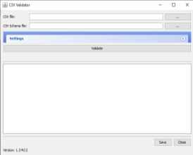
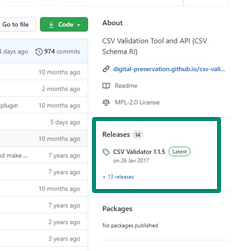
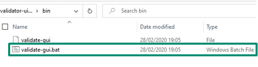
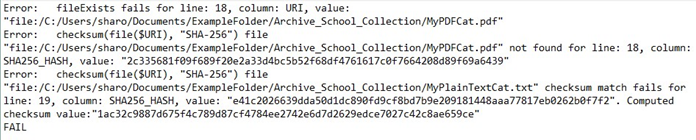

::: {.callout-warning}
This page was created in 2011 and may be out of date!
:::

# CSV Validator

## Introduction

In the section on the tool DROID we look at how to use it to characterize digital content. There is it noted that DROID also has the functionality to generate checksums, although it does not offer integrity checking. We can, however, use the checksums generated by DROID with another tool from The National Archives (UK) (TNA) to carry out integrity checking. That tool is CSV Validator and this page will provide an overview of the tool and take you step by step through how to use it.

**Please note:** if you are not familiar with the tool DROID, it is recommended that you read through that content before working through this page.

## What is CSV Validator?

CSV Validator was developed by TNA to allow automated validation of metadata supplied by depositors of digital content. It compares the metadata with a schema, a type of file that details the requirements for the structure and content of a document. In addition to using CSV Validator for checking metadata, the Digital Preservation team at TNA have created a publicly available schema that can be used with the tool to enable integrity checking. The tool uses the schema alongside a .csv file of data exported from DROID after characterization to carry out the check. CSV Validator generates a checksum for each file and, according to the rules in the schema, compares it with the information in the DROID generated .csv file, and highlights any errors found. For example, missing files or mismatched checksums.

## Why Use CSV Validator?

If you are already planning to use DROID for characterization, and generating basic metadata, using the outputs with CSV Validator for integrity checking can make sense. It means that you do not need to store checksums separately, reducing the number of additional files you need to keep alongside the digital content. CSV Validator also provides useful details in its results log when an error is detected during integrity checking, which can make identifying issues easier.

The main drawback of CSV Validator is that it is a bit more awkward than other tools to use for integrity checking after moving a file. It requires the user to provide extra information about where the files were and where they have been moved to. We will, however, cover how to do this on this page. The need to use a schema can also be off-putting for some, but it is actually quite straightforward. Finally, the tool is only available for those with Windows or UNIX/LINUX computers.

## Downloading CSV Validator

CSV Validator and the schema you will need for integrity checking are both available for the TNA’s Digital Preservation Team’s repository on the website GitHub.

CSV Validator can be downloaded via the “Releases” section here: <https://github.com/digital-preservation/csv-validator> (see right).

The Schema document (DROID_integrity_check.csvs) can be downloaded here: <https://github.com/digital-preservation/droid-csv-schema>.

To run CSV Validator you also will also need to have Java installed on your computer. If you need to install Java you can find it here: <https://www.java.com/en/>

## Opening CSV Validator

CSV Validator is not installed on to your computer in the same way most apps we use are. Rather we must open it from the files we downloaded each time.

To open CSV Validator, we must first extract the files from the .zip file we downloaded. These can be saved wherever is convenient on your computer. Next, navigate to the “bin” folder, which is in the main folder. To open the tool on a Windows computer we then double-click on the “validate-gui.bat” (Batch) file. A command line window will appear (do not close this) and then the interface for CSV Validator.

## Editing the Schema

The final step we need to complete before running an integrity check with CSV Validator is editing the schema document. The document is quite intimidating at first, but there is actually only one small part of the document that needs to be edited.

The easiest way to edit the file is to open it in a simple text editor such as “Notepad”. The first twenty-eight lines are notes on the schema and how to use it, so those can be ignored. The line you need to edit is the following:

**URI: fileExists integrityCheck("","files","includeFolder")**

All that needs changed is to replace the word “files” with the name of the top level folder of the digital content covered by the relevant DROID report. You will need to edit the schema for each new DROID report you run the process with. It is also important not to change the file extension of the schema file, it should be “.csvs”.

Once the tool is downloaded and the schema prepared, we are ready to run an integrity check.

## Running an Integrity Check

In the video below we will work through the steps of running an integrity check using CSV Validator and our DROID output, starting with opening the tool from its “batch” file. In this example we assume we have already prepared our schema file and that the digital content has not been moved since we created the DROID output file.

Saving the results of the integrity check can act a record of the successful completion of the process. The saved file is not assigned a file type automatically, so it is important to type a file extension when saving. In the example we chose to save the results as a Text (.txt) file.

In this example the check was successful, resulting in a PASS for all files. But what happens if an error is detected?



## Finding an Error during an Integrity Check

In the video above we ran an integrity check where the results said everything was OK (i.e. no files had changed or were missing). This time round the files are from a less perfect future where some errors may have occurred…



The image above shows the results file from the integrity check process. The first two errors relate to a file called “MyPDFCat.pdf”, showing that there has been a fail for the “fileExists” check and also that is was not found when trying to generate checksums. Therefore, we can assume this file has been deleted or moved out of this folder.

The third error shows that the checksum does not match for the file “MyPlainTextCat.txt”, in this case we can assume that a change has been made to the file. We will need to investigate both of these errors further and may need to replace the files from another copy.

##  What if the Digital Content Had Been Moved?

The two demos above assumed that the digital content had not been moved since the DROID analysis had been completed. But, one of the most important times to complete an integrity check is after moving content (for example, from an ingest processing area of the network to an archive drive). As CSV Validator uses the file path information in the CSV file to locate the files for the integrity check, we must provide it with details of where the files have been moved to. This is done using a “path substitution”. The video demostrates the process again also including a path substitution.



Although the process for entering a file path substitution is relatively straightforward, getting the file path correct can sometimes take a bit of trial and error. If CSV Validator produces results that state the files do not exist, this is normally an indicator that there is an error in file path entered (rather than all of the files have been lost!) So be prepared that you might need to try the process a few times before it works perfectly...
