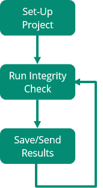
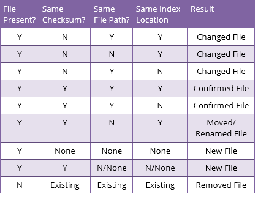
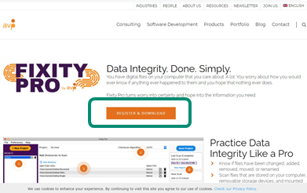
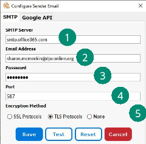
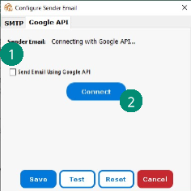
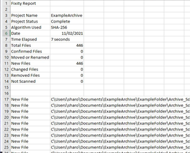

::: {.callout-warning}
This page was created in 2011 and may be out of date! 

Note that Fixity Pro has been transferred to the Open Preservation Foundation, and no longer requires registration or a subscription. <https://fixitypro.com/>
:::

# Fixity Pro

## Introduction

On this page we will be looking at how to use an integrity checking tool called Fixity Pro. We will start with an introduction to the tool and why it is useful. We will then cover how the tool works, and downloading and installing it, before going step by step through setting it up for integrity checking. Finally, we will examine the results that Fixity Pro produces, and how we can use this information. So, time to answer the first question: What is Fixity Pro?

## What is Fixity Pro?

Fixity Pro is an integrity checking tool developed and maintained by an organization called AVP. Unlike some other integrity checking tools, it was developed specifically for the Digital Preservation community, with common processes/workflows in mind. Fixity Pro can be downloaded on AVP’s website and there is a small monthly subscription cost (reduced for those who pay annually). There is also a full user guide available, and AVP maintains a user group forum to provide information and support. Also, unlike some other tools, Fixity Pro is available for both Windows and Mac.

Fixity Pro not the first version of the tool, an earlier version known as simply “Fixity” has been available for free for a number of years. This version is still downloadable from the AVG website but technical support is no longer available.

## Why Use Fixity Pro?

As mentioned above, Fixity Pro was developed with digital preservation processes in mind. It, therefore, offers additional functionality to help with digital preservation tasks that other tools do not. The most important benefit of using Fixity Pro is that it allows for the scheduled automation of integrity checking. Once set-up correctly, Fixity Pro will carry out regular integrity checks and staff will only need to intervene in the process if an error is identified. Fixity Pro also automatically saves the results of the process in easy to interpret reports which it can email to you.

Fixity Pro does, however, have a few limitations. The most important of which is that is only offers a choice of two checksums types, although they are two of the most popular, MD5 and SHA-256. Also, we must be able to link the tool to an email account, which might be difficult for those at organizations with strict controls on their systems.

## How Fixity Pro Works

The process of integrity checking with Fixity Pro revolves around the creation of “projects”. In each project one or more folders are added and integrity checks are scheduled at regular intervals to monitor the integrity of the files in over time. Checks can be scheduled daily, weekly, or monthly. Unless content is at high risk, monthly checks will likely be enough for most content. Also, although Fixity Pro does scale up reasonably well, if you are scheduling a check on a large collection you may wish to set this for a time the computer is not used for other work.

The tool then carries out the integrity checks automatically as scheduled and both saves the results in a nominated folder and emails them to addresses that have been added to the project. The results are stored in two files, a manifest which lists the files and their checksums, and a report on the outcomes of the integrity check. Once set up, the tool will continue to carry-out the checks as scheduled until the project is removed.

## Outcomes of an Integrity Check with Fixity Pro
For each file it checks, Fixity Pro will report if the file is “confirmed” (the same), “changed” (the file contents), “new”, “removed” (deleted), and “moved and/or renamed”.

The table on the left shows the four criteria that Fixity Pro checks and how it decides the status of each file according to these categories. This table is from the Fixity Pro User Manual.

## Downloading and Installing Fixity Pro
A 30-day free trial of Fixity Pro can be downloaded from the AVP website. It is available here:

<https://www.weareavp.com/products/fixity-pro/>

You can also access the User Guide and other supporting resources from this page.

When you click on the “Register & Download” button, you will be asked to provide your name, organization, and email. You will then receive an email to confirm your registration. Clicking the link in the email will take you to a page where you can download Fixity Pro. Double-click on the downloaded file and follow the instructions to install. You will require an activation code to finish the installation process and this will be emailed separately.

Once your free trial has expired you will need to take out a monthly or annual subscription to continue use.

## Setting Email Preferences

**Simple Mail Transfer Protocol (SMTP)**

**To allow Fixity Pro to email integrity check results, we must provide a connection to an email account. This is done using an SMTP (Simple Mail Transfer Protocol) connection or the Google API for Gmail. Email reports sent from Fixity Pro will then come from this account.

To set up an SMTP connection, click on Preferences, then “Configure Sender Email”. In the pop-up box enter the following information:

1.  The SMTP server (e.g. smtp.office365.com)
2.  The email address (e.g. sharon.mcmeekin@dpconline.org)
3.  The email account password
4.  The port that should be used to make the connection
5.  What type of encryption is used (SSL, TLS, or none)

If you do not know the information needed in 1, 4, and 5, you may need to ask an IT colleague for help. It is possible to find this using a simple Google search for most common email providers. Also keep in mind that some networks may not allow this type of connection.

**Gmail**

Establishing a connection to a Gmail account is much easier. We simply need to follow these steps:

1.  Select the box “Send Email Using Google API”
2.  Click the “Connect” button
3.  Sign in to the relevant Gmail account
4.  Click “Allow” button to let Fixity send emails on your behalf.

Both options allow you to test the email connection using the “Test” button. If an email does not appear in the relevant inbox, also check the SPAM folder as it may be redirected there.

No matter which option is used, remember to click the “Save” button to save the email preferences.

The “Reset” button can be used to clear current email preferences.

## Other Preferences

There are a few other preferences available in Fixity Pro that you may wish to set, although they are not required as the email connection is.

Those settings are:\
**Filter Files** – this allows the user to filter out particular file types by extension, e.g. this is often used to filter out system files like thumbs.db in Windows.\
**Import Project** – allows the user to import a file created in another instance of Fixity. This might be used when receiving a deposit.\
**Checksum Algorithm** – this is where you can choose between the MD-5 and SHA-256 checksum types. This preference is only available when you have a project listed.\
**Reports Location** – this allows you to select a folder for where the reports from checks will be saved. The default is in the “Documents” folder.

Now that all the preferences are set, you are ready to create a project and run an integrity check.

## Creating a Project and Running an Integrity Check

In the video below we will work step by step through a demo of how to create a project in Fixity Pro and run an initial integrity check. The steps in creating a project relate closely to the four boxes you will find on the interface:

1.  Starting and naming a new project
2.  Adding the folders to be checked
3.  Scheduling the integrity checks
4.  Inputting the addresses for emailing reports



## Results Reports

The image on the right shows a snapshot of a results report from Fixity Pro. The results are produced in a .tsv (tab separated values) format which can be opened in a simple text editor like Notepad or a spreadsheet program like Excel.

The report provides a summary at the top and details for the files below. In this example, opened in Excel, we can see that the check was carried out on 11/02/21, took 7 seconds to complete, and found 446 “new” files (as this was a first check). Future checks will have “confirmed” files if all is OK, or other types of files (as discussed previously) if there are errors or changes. Each check runs its comparison against the previous check, so if errors are discovered and fixed a new manual check should be run to reestablish the correct checksums.
