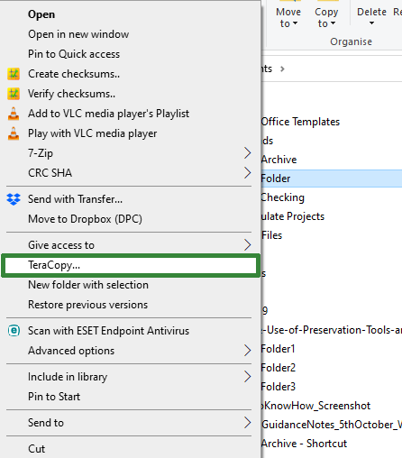
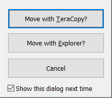

::: {.callout-warning}
This page was created in 2011 and may be out of date!
:::

# Teracopy

## Introduction

This page will provide an overview of a useful tool for digital preservation: Teracopy. It will start by introducing Teracopy and describing why you may wish to use it. We will then go through how to download and open the tool and what preferences to set, and will finish with how to use the tool to copy digital content safely.

## About Teracopy

## What is Teracopy?

Teracopy is “file transfer utility”, a tool for copying or moving digital content, that provides an alternative to the built-in (and more limited) functionality that is available within Windows Explorer. It is available under a “freemium” licence: meaning that there is a free version that can be used for non-commercial purposes, as well as a paid-for Pro version with additional functionality that can be used in commercial environments. The free version is generally suitable for the purposes of digital preservation.

## Why Use Teracopy?

The main reason to use Teracopy is that it incorporates integrity checking into its transfer process. An integrity check should be carried out whenever digital content is copied or moved, therefore using Teracopy streamlines the transfer process, consolidating two tasks into one. Teracopy also allows users to pause and resume a transfer of digital content, provides a detailed log of the folders and files copied or moved, and can output a copy of the checksums generated for future use. The only major failing of the tool is that if a file or folder is skipped due to an error occurring, Teracopy does not provide details of what type of error was encountered. It can be used for any copy action, including transferring content within a network or from external storage into your digital archive.

## Downloading, Installing, and Opening Teracopy

Teracopy can be quickly and easily downloaded from the website of Code Sector, the software company that developed and maintains the tool. The link to use is as follows:

<https://www.codesector.com/teracopy>

You can also purchase the Pro version via this page, as well as making requests for new functionality, and finding information on the development status of new versions.

Teracopy is easy to install, just double-click on the downloaded file and follow the instructions as with other software packages.

Once Teracopy is installed there are three ways to access it:

1.  Via the standard Windows menu.
2.  By right-clicking on a file or folder you want to move or copy (Teracopy will be listed on the menu (see left))
3.  A dialogue box will pop up when you start to carry out a copy or move action (e.g. by drag and drop) that will ask if you want to use Teracopy (see right)

## Setting Preferences in Teracopy

In this section we will walk through a demo of setting your preferences in Teracopy. This will help you to get the most from the tool. It is particularly important as integrity checking is not a default setting within Teracopy. It must be turned on before the first time you use the tool.



Once you have set your preferences in Teracopy it is worthwhile closing the tool and reopening to ensure that the new settings are all ready for use. Before closing the tool interface, it should look like the version on the top left. Once the tool has been closed and reopened it should look like the bottom left window (if you have selected all of the options included in the demo). Now we will look at copying files with Teracopy.

## Copying Files with Teracopy

With our preferences set, we are now ready to use Teracopy to robustly copy digital content. In this section we will walk through a step by step demo of how to set up and run a copy process in Teracopy.



## Wrap-Up

Teracopy is an easy to use tool that will allow you to safely copy digital content.

Remember, after you have downloaded and installed the tool, and set preferences, the steps are simply as follows:

1.  Add the files/folders you wish to copy
2.  Identify where they should be copied to
3.  Make sure the correct type of checksums are being used
4.  Hit the “Copy” button to start!

If you opted to save the checksums from the process you can use Teracopy to check them at a later date (although it isn’t the quickest tool to use for large collections).
